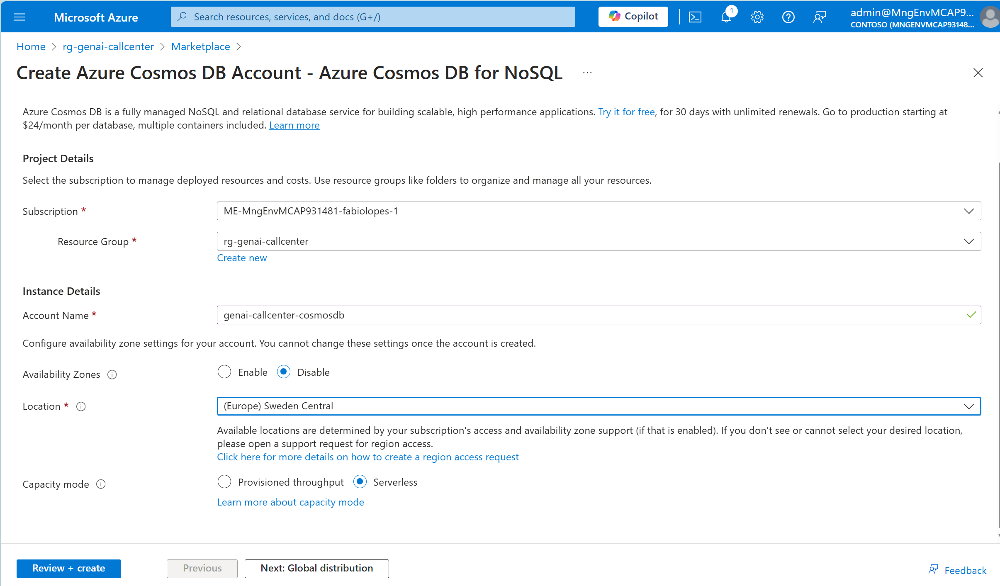
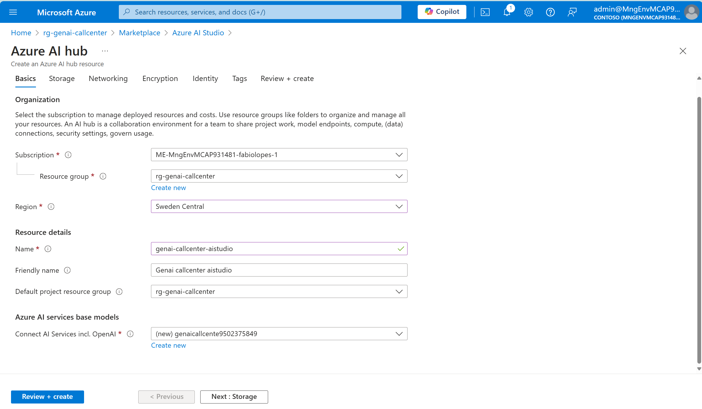
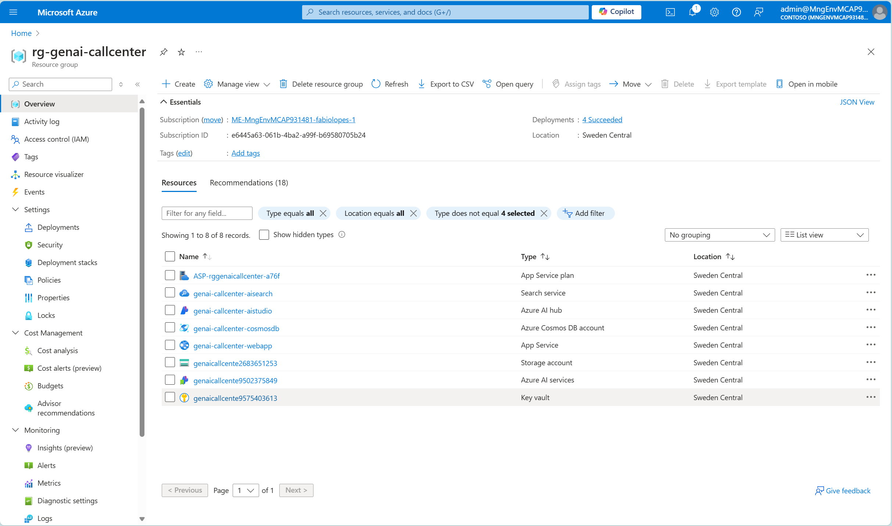
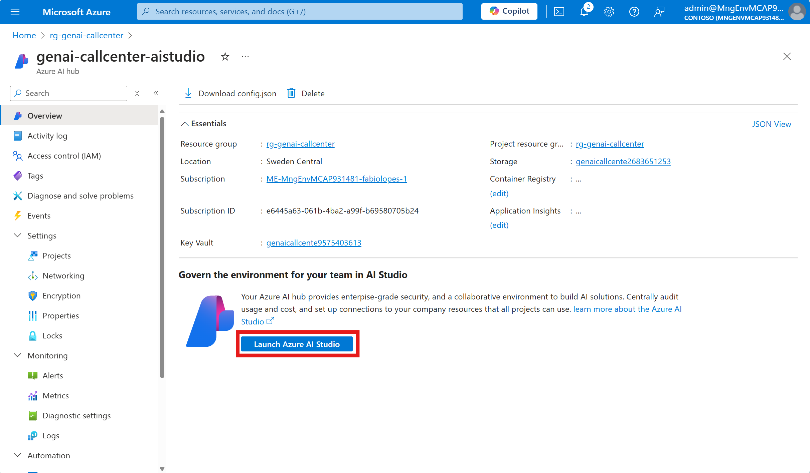
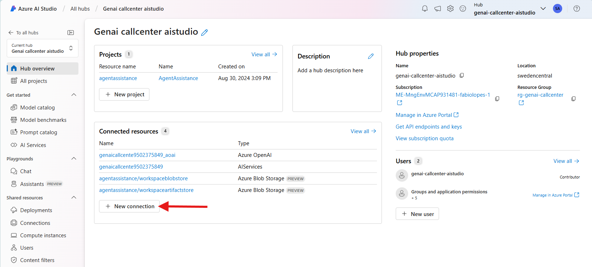
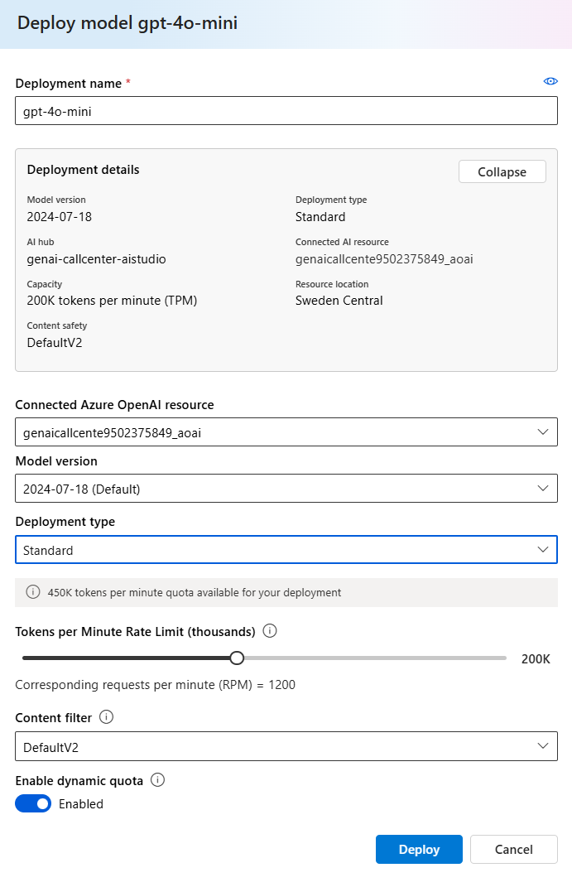
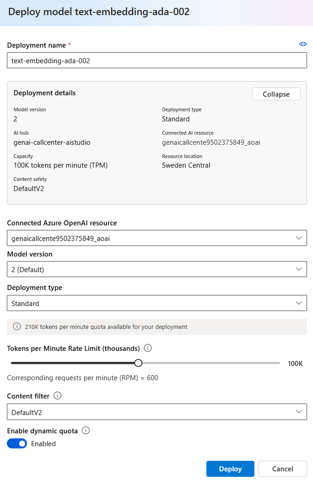
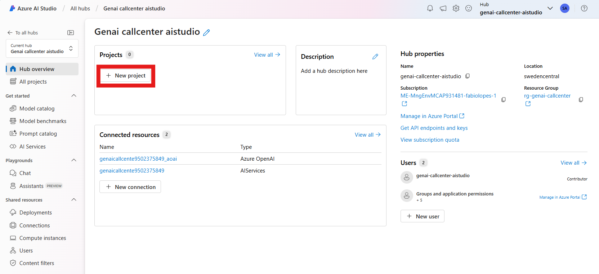

# Challenge 1 - Resources Deployment

**Expected Duration:** 90 minutes

## Introduction
Your goal in this challenge is to create the services necessary to conduct this hackathon. You will deploy the required resources in Azure, including the Azure AI services that will be used in the subsequent challenges. By completing this challenge, you will set up the foundation for the rest of the hackathon.

## Introduction to the services

###  Azure AI Search
Azure AI Search (formerly known as "Azure Cognitive Search") is a platform that provides secure information retrieval at scale over user-owned content in traditional and generative AI search applications. It supports full-text and vector search scenarios and includes optional integrated AI to extract more text and structure from raw content. Azure AI Search provides a dedicated search engine and persistent storage of your searchable content. It also includes optional, integrated AI to extract more text and structure from raw content, and to chunk and vectorize content for vector search.

###  Azure Cosmos DB
Azure Cosmos DB is a globally distributed, multi-model database service provided by Microsoft Azure. It is designed to provide low latency, elastic scalability of throughput, well-defined semantics for data consistency, and high availability. Azure Cosmos DB supports multiple data models including key-value, documents, graphs, and columnar. It is a good choice for any serverless application that needs low order-of-millisecond response times and needs to scale rapidly and globally.

###  Azure AI Studio
Azure AI Studio is a comprehensive toolchain that provides a unified experience for AI developers and data scientists to build, evaluate, and deploy AI models through a web portal, SDK, or CLI. It allows users to deploy serverless models and get started quickly with ready-to-use APIs without the need to provision GPUs. AI Studio provides access to collaborative, comprehensive tooling to support the development lifecycle and differentiate your apps, including Azure AI Search, fine-tuning, prompt flow, open frameworks, tracing and debugging, and evaluations. It also offers responsible AI tools and practices to design and safeguard applications, as well as enterprise-grade production at scale to deploy AI innovations to Azure's managed infrastructure with continuous monitoring and governance across environments.

###  Azure Web App
Azure Web App is a fully managed platform for building, deploying, and scaling web apps. It supports multiple programming languages and frameworks, including .NET, Java, Node.js, Python, and PHP. Azure Web App provides built-in auto-scaling and load balancing, along with a robust set of DevOps capabilities such as continuous deployment from GitHub, Azure DevOps, or any Git repository. It also offers integrated monitoring and diagnostics to ensure high availability and performance. With Azure Web App, you can quickly build and deploy mission-critical web applications that meet rigorous compliance requirements.

## Resource Deployment Guide
Clicking on button bellow will redirect you to the Azure portal to deploy the resources using the [ARM template](../iac) provided in this repository.

If you prefer to deploy the resources manually, follow the steps below.

### Manual Deployment
1. Navigate to the [Azure portal](https://portal.azure.com/#home) and login with your account.
2. Navigate to your resource group. In this guide, the resource group is named `rg-genai-callcenter`. At this point, it should be empty.

3. Let's create our **Azure AI Search Service**. 
    * Click on the `Create` button.
    * Search for `Azure AI Search` and click `Create`.
    * Fill the *Service name* field (needs to be unique in the chosen region) and select the *Location*. In this guide, all resources are going to be deployed in the `Sweden Central` region. 
    * Choose your *Pricing Tier* for this exercise. In this guide, we will use `Basic`.
    * Click on `Review + Create` and then `Create`.
    
    * Wait for the deployment to complete.
4. Navigate to your resource group.
5. Let's create our **Cosmos DB Service**.
    * Click on the `Create` button.
    * Search for `Azure Cosmos DB` and click `Create`.
    * Select `Azure Cosmos DB for NoSQL`.
    * Fill the *Account name* field and select the *Location*. Be sure to use the same *Location* for all services wherever possible.
    * In the *Capacity Mode* field, select `Serverless`.
    * Click on `Review + Create` and then `Create`.
    
    * Wait for the deployment to complete.
    * Navigate to the resource page and, from the left tabs, select `Data Explorer`.
    * Click on `New Container`.
    * Fill the `Database id` with *callcenter*.
    * Fill the `Container id` with *calls*.
    * Fill the `Partition key` with *id*.
    * At the bottom of the page, click `Ok`.
    
6. Navigate to your resource group.
7. Let's create our **Azure AI Studio**.
    * Click on the `Create` button.
    * Search for `Azure AI Studio` and click `Create`.
    * Fill the *Name* field and select the *Region*. Be sure to use the same *Location* for all services wherever possible.
    * Click on `Review + Create` and then `Create`.
    
    * Wait for the deployment to complete.
8. Navigate to your resource group.
9. Let's create our **Azure Web App**.
    * Click on the `Create` button.
    * Search for `Azure Web App` and click `Create`.
    * Fill the *Name* field and select the *Region*. Be sure to use the same *Location* for all services wherever possible.
    * In the *Publish* field, select `Code`.
    * In the *Runtime stack* field, select `Python 3.12`.
    * In the *Pricing Plan* field, select `Basic B1`.
    * Click on `Review + Create` and then `Create`.
    * Wait for the deployment to complete.
10. Navigate to your resource group.
11. You should now have all the services deployed in your resource group:
    * An Azure AI Search Service
    * An Azure Cosmos DB account
    * An Azure AI Studio
    * An Azure App Service
    * An Azure App Service Plan
    * An Azure Storage Account (deployed automatically by AI Studio)
    * An Azure Key Vault (deployed automatically by AI Studio)
    * An Azure AI Services (deployed automatically by AI Studio)
    

## Setup Azure AI Studio
1. Navigate to your resource group.
2. Click on the **Azure AI Studio** resource name.
3. Click on the `Launch Azure AI Studio`.

4. On the `Hub Overview` tab, click on `New connection`.

5. Select the `Azure AI Search`.
6. From the list of possible AI Search services, select the one you created in the previous steps and click `Add connection`.
7. Navigate to the `Hub Overview` tab.
8. From the left pane, select `Deployments`.
9. Click `+ Deploy model` and `Deploy base model`.
10. Select `gpt-4o-mini` and click `Confirm`. If you do not have `gpt-4o-mini` available in your chosen region, select `gpt-4o` or `gpt-3.5-turbo`.
11. Click on `Customize`.
12. Fill the `Deployment name`.
13. In `Deployment Type`, select either *Standard* or *Global Standard*. **DO NOT select *Provisioned* or *Global Batch***.
14. In the `Tokens per Minute Rate Limit (thousands)` select at least 200k. If this is blocked for you, there might be other resources consuming quota in your subscription. Please check with your subscription administrator.

15. Return to the `Deployments` page.
16. Click `+ Deploy model` and `Deploy base model`.
17. Select `text-embedding-ada-002` and click `Confirm`.
18. Click on `Customize`.
19. Fill the `Deployment name`.
20. In `Deployment Type`, select either *Standard*.
21. In the `Tokens per Minute Rate Limit (thousands)` select at least 100k. If this is blocked for you, there might be other resources consuming quota in your subscription. Please check with your subscription administrator.

22. Return to the `Hub Overview`.
23. Click on `+ New project`.

24. Give your project a name and click on `Create a project`.

25. Wait for the project to be created.

## Conclusion
By reaching this section you should have every resource necessary to conduct the hackathon. You have deployed an Azure AI Search service, an Azure Cosmos DB account, and an Azure AI Studio. In the next challenges, you will use these services to build a call center application.

## Learning Material
- [Azure AI Search](https://learn.microsoft.com/en-us/azure/search/search-what-is-azure-search)
- [Azure Cosmos DB](https://learn.microsoft.com/en-us/azure/cosmos-db/introduction)
- [Azure AI Studio](https://learn.microsoft.com/en-us/azure/ai-studio/what-is-ai-studio)
- [Azure OpenAI](https://learn.microsoft.com/en-us/azure/ai-services/openai/overview)
- [Automate deployment of resources using Bicep](https://learn.microsoft.com/en-us/azure/azure-resource-manager/bicep/overview?tabs=bicep)