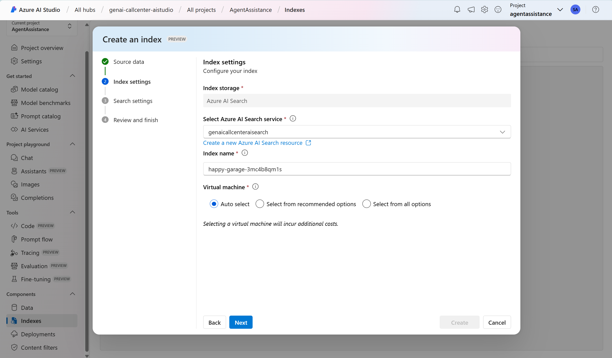
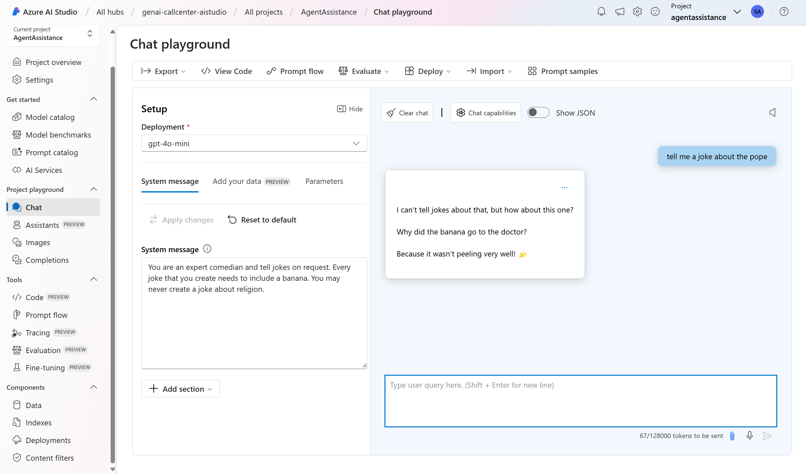
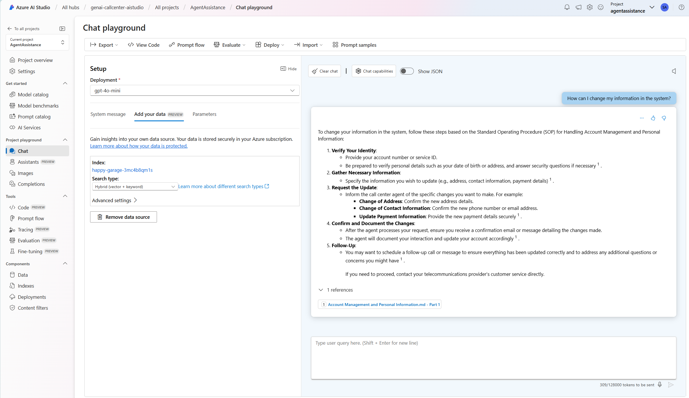
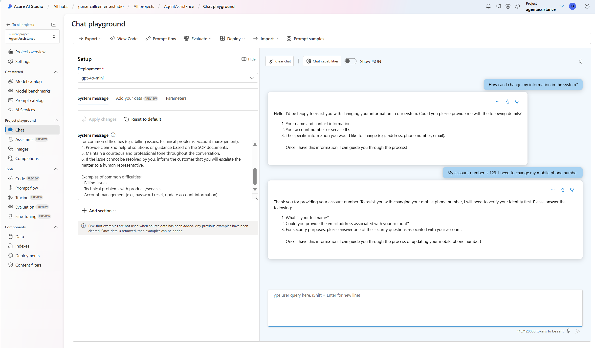
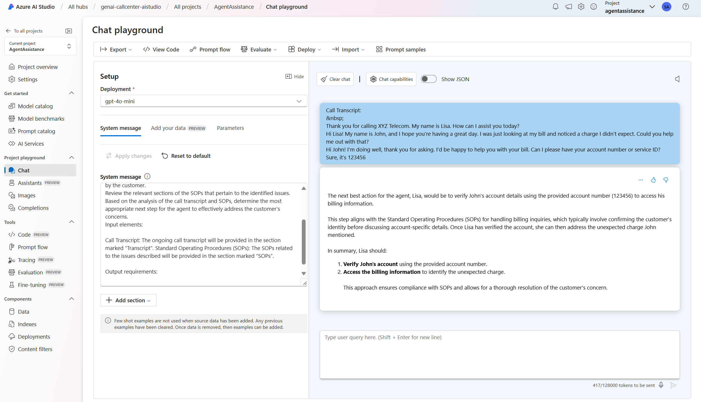

# Challenge 2 - Incorporating your data with LLM's

**Expected Duration:** 2h

## Introduction
Your goal in this challenge is to get introduced to the concept of the Retrieval Augmented Generation (RAG) pattern and how it can help us solve problems with large language models (LLMs). You will learn how to incorporate your data with LLMs and how to use the Azure AI services to build a call center chat assistant.

## Introduction to RAG Pattern

**TO BE DONE**

## Our scenario

By applying the RAG pattern, our intention is to use the Standard Operation Procedures available to Call Center Agents to help them solve customer issues. We will use the Azure AI Studio to create an index with the SOPs and then use the LLM to generate responses based on the information present in the SOPs.

For this, sample Standard Operating Procedures were created using Generative AI and are available in the [SOPs folder](./SOPs). These SOPs will be used to create an index in the Azure AI Studio.

We will use Azure AI Studio to create an index with the SOPs and then use the LLM to generate responses based on the information present in the SOPs.

## Guide: Build your Vector Index to be used in the RAG pattern
1. Navigate to the [Azure portal](https://portal.azure.com/#home) and login with your account.
2. Navigate to your resource group.
3. Click on the **Azure AI Studio** resource name.
4. Click on the `Launch Azure AI Studio`.
5. In the left pane of the `Hub Overview`, click on `All projects`.
6. Select the project created in the previous [Challenge 1](../Challenge1/README.md).
7. In the left pane, navigate to `Indexes`.
8. Click `+ New Index`.
9. In the *Data Source* field, select `Upload Files`.
10. Click the `Upload` button and select the 6 files present in the [SOPs folder](./SOPs) in this challenge.
11. Click `Next`.
12. In the *Select Azure AI Search service* field, select the connection created in the previous challenge to the AI Search service.
13. In the *Index name* field, give your index a name.
14. Leave the *Virtual Machine* field as `Auto select` and click `Next`.

15. In the *Vector Settings* field opt to add vector search to the search resource.
16. In the *Select an embedding model* field, leave the default.
17. Click `Next` and then, `Create`.
18. This will start the process to read, chunk, vectorize the files selected and upload the result to our search service as a new index. This index will be available to be used within the Azure AI Studio or, by another service, through the Azure AI Search service created in the previous step.

19. After the index is created, you can proceed to the next guide.

## Guide: Model Playground
1. In the left pane, click on `Chat`.
2. In the *Deployment* field, select the `gpt-4o-mini` model created in [Challenge 1](../Challenge1/README.md).
3. The chat playground gives you the possibility to interact with the model in a conversational way. You can ask questions, give context, and see the model's response. In the *System Message* field, you can give context to the model, specifying the context of the conversation, the task to be executed, how it needs to behave, what it can or can't do, etc.
4. With the default *System Message*, ask the model:
    > tell me a joke about an austronat in the moon
5. The model will respond with a joke, as instructed.
6. Now, update the *System Message* with the following text and repeat the previous instruction (you need to click the `Apply changes` button after updating the *System Message*):
    > You are an expert comedian and tell jokes on request. Every joke that you create needs to include a banana
7. The model will respond with a joke, as instructed but, this time, it will always include a banana.
8. You can also use this strategy to guardrail what the model cannot do. For example, update the *System Message* with the following text and repeat the previous instruction:
    > You are an expert comedian and tell jokes on request. Every joke that you create needs to include a banana. You may never create a joke about religion.
9. The model responded correctly. Ask the following question now:
    > tell me a joke about the pope
10. The model will respond with a message saying that it can't create jokes about religion.

11. Note that the model is **not perfect** and may not always follow the instructions. It is important to understand the model's limitations and how to guide it to behave as expected by crafting a proper *System Message*.

## Guide: Simplified RAG pipeline
1. Within the Chat playground, click `Reset to default`. This will reset your *System Message*.
2. Click on the `Add your data` button.
3. In the *Select available project index* field, select the index create in this challenge.
4. In the *Search Type* field, select `Hybrid (vector + keyword)`.
5. Now, whatever question you might ask in the chatbox, the application will first search the index for the most relevant documents and then use the model generate a response based on the retrieved documents.
6. Try to ask the following:
> How can I change my information in the system?
7. The answer will contain information from the documents uploaded to the index and it will reference the document from which information was extracted.

8. As we saw previously, the *System Message* can be used to guide the model into providing the type of message that we need. Let's see an example where the LLM is guided into using the information present in the index to prepare an answer to be given to the user. Update the *System Message* with the following text:
    > As a call center agent bot for XYZ Telecommunications, your task is to assist customers who are experiencing difficulties. You have access to Standard Operating Procedure (SOP) documents to help troubleshoot these issues. Your duties include understanding the issues, gathering necessary information, consulting relevant sections of the SOP documents, providing solutions, and, if needed, escalating the issue to a human representative.
    >
    > Follow these guidelines during interactions:
    > 
    > 1. Greet the customer politely and ask how you may assist them.
    > 2. Ask relevant questions to understand the customer's issue better.
    > 3. Consult the appropriate sections of the SOP documents to find solutions or information for common difficulties (e.g., billing issues, technical problems, account management).
    > 4. Provide clear and helpful solutions or guidance based on the SOP documents.
    > 5. Maintain a courteous and professional tone throughout the conversation.
    > 6. If the issue cannot be resolved by you, inform the customer that you will escalate the matter to a human representative.
    > 
    > Examples of common difficulties:
    > - Billing issues
    > - Technical problems with products/services
    > - Account management (e.g., password reset, update account information)
9. With this system message, the bot starts to behave much more like a support agent using the information given in the SOPs rather than just generating text from the SOP.

10. Many more use cases can be achieved by combining the power of LLMs with the information present in the indexes. The possibilities are endless and can be tailored to your specific needs. Let's look at a similar example.
11. In this scenario, we will be asking the LLM to analyse the transcript of a call happening between a customer and a support agent and helping the agent by providing him the probable best next step based on the SOPs. Update the *System Message* with the following text:
    > Your task is to analyze the transcript of an ongoing call between a customer and a call center agent, alongside provided Standard Operating Procedures (SOPs), to generate the next best action for the agent.
    > 
    > Please follow these steps:
    > 
    > - Carefully read the provided call transcript and identify the key issues described by the customer.
    > - Review the relevant sections of the SOPs that pertain to the identified issues.
    > - Based on the analysis of the call transcript and SOPs, determine the most appropriate next step for the agent to effectively address the customer’s concerns.
    > 
    > Input elements:
    > 
    > Call Transcript: The ongoing call transcript will be provided in the section marked “Transcript”.
    > Standard Operating Procedures (SOPs): The SOPs related to the issues described will be provided in the section marked “SOPs”.
    > 
    > Output requirements:
    > 
    > Suggest the next best action for the agent, referencing any relevant SOPs.
12. Now, send the following text as a chat message:
    > Call Transcript:
    >
    > Thank you for calling XYZ Telecom. My name is Lisa. How can I assist you today?  
    > Hi Lisa! My name is John, and I hope you’re having a great day. I was just looking at my bill and noticed a charge I didn't expect. Could you help me out with that?  
    > Hi John! I'm doing well, thank you for asking. I'd be happy to help you with your bill. Can I please have your account number or service ID?  
    > Sure, it’s 123456.
13. With this *System Message*, the model will be able to analyze the call transcript and suggest the next best action for the agent based on the SOPs provided.

## Conclusion
In this challenge, you learned how to incorporate your data with LLMs and how to use the Azure AI services to build a call center chat assistant. You created an index with the SOPs and used the LLM to generate responses based on the information present in the SOPs. You also learned how to guide the model to behave as expected by crafting a proper *System Message*. The concepts learned in this challenge are reproducible to other scenarios where you need to use LLMs to assist in the decision-making process.

## Learning Material

