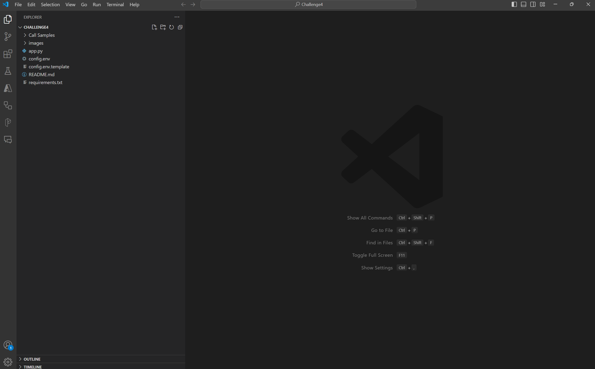

# Challenge 4 - Real-time call transcription and agent assistance

**Expected Duration:** 2h

## Introduction

**TO BE DONE**

## Our scenario

**TO BE DONE**

## Install the required programs
### Visual Studio Code
- Windows
    - Install [Visual Studio Code](https://code.visualstudio.com/)
- Linux
    - Install [Visual Studio Code](https://code.visualstudio.com/)
- Mac
    - Install [Visual Studio Code](https://code.visualstudio.com/)

### Python
- Windows
    - Install [Python 3.12.2](https://www.python.org/downloads/release/python-3125/)
- Linux
    - It is usually pre-installed. Check version with `python3 --version`.
- Mac
    - `brew install python3`

## Guide: Setup local environment
1. Clone the repository to your local machine.
2. Navigate to the chosen location and locate the `Challenge4` folder.
3. Open this folder in Visual Studio Code.

4. Open a new terminal in Visual Studio Code. (You can use the top bar of Visual Studio, in the `Terminal` tab).
5. Create the virtual environment by running the following command:
    - Windows
        - `python -m virtualenv venv`
    - Linux / Mac
        - `virtualenv -p python3 venv`
6. Activate the virtual environment by running the following command:
    - Windows
        - `.\venv\Scripts\activate.ps1`
    - Linux / Mac
        - `source ./venv/bin/activate`
7. Install the necessary packages to run the application:
    - Windows / Mac / Linux
        - `pip install -r requirements.txt`
8. You can close the terminal.
9. Navigate to the `Challenge4` folder.
10. Duplicate the `config.env.template` file and rename it to `config.env`.
11. Open the `config.env` file and fill in the necessary information.
    * Navigate to the [Azure portal](https://portal.azure.com/#home) and login with your account.
    * Navigate to your resource group.
    * Select the `Azure AI services` resource. In the `Overview` section, you will find the `KEY 1` and `Location/Region` information. Fill in the `SPEECH_KEY` and `SPEECH_REGION` fields in the `config.env` file.
    
    * Navigate to your resource group.
    * Select the `Azure AI Studio` resource and launch it. Navigate to `Deployments` and select the deployment created in the previous [Challenge 3](../Challenge3/README.md). In the `Consume` section, you will find the `REST Endpoint` and `Primary Key`. Fill in the `PROMPTFLOW_DEPLOYMENT_URL` and `PROMPTFLOW_DEPLOYMENT_KEY` field in the `config.env` file.
    
    * Navigate to your resource group.
    * Select the `Cosmos DB Account` resource. In the left pane, select `Keys`. You will find the `URI` and `PRIMARY KEY` information (in the Read-write Keys). Fill in the `COSMOSDB_CONNECTION_URL` and `COSMOSDB_CONNECTION_KEY` fields in the `config.env` file.
    
    * Fill in the `COSMOSDB_DATABASE_NAME` and `COSMOSDB_CONTAINER_NAME` fields in the `config.env` file with the values specified in [Challenge 1](../Challenge1/README.md). If you followed the guide, the values should be `callcenter` and `calls`, respectively.
    

## Guide: Explain the app

**TO BE DONE**

## Guide: Run the app
1. Navigate to the `Challenge4` folder.
2. Open a terminal window and run the following command: `streamlit run app.py`

3. A new tab will open in your default browser with the application running. If not, use the *Local URL* provided in the terminal.
4. From the dropdown list, you can select a [Call Sample](<../Challenge4/Call Samples/Audio/>) and click on the `Start` button.

5. The application will start transcribing the call and providing suggestions to the agent in real time. Every time the application detects that a complete phrase was spoken, it will call the Prompt Flow endpoint and update all the info to the agent.

6. After the transcription is finished, the application will save the call information in the Cosmos DB database.
7. Navigate to the [Azure portal](https://portal.azure.com/#home) and login with your account.
8. Navigate to your resource group.
9. Select the `Azure Cosmos DB` resource.
10. Navigate to the resource page and, from the left tabs, select `Data Explorer`.
11. You should see your database and container created in [Challenge 1](../Challenge1/README.md).

## Conclusion
Add things here.

## Learning Material
Add things here.