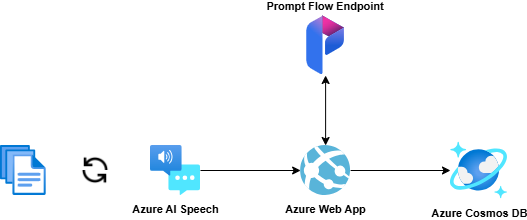
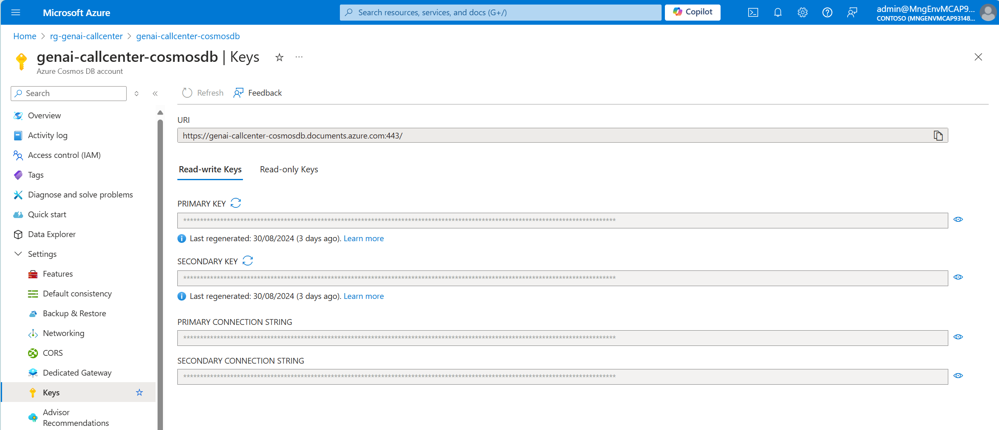
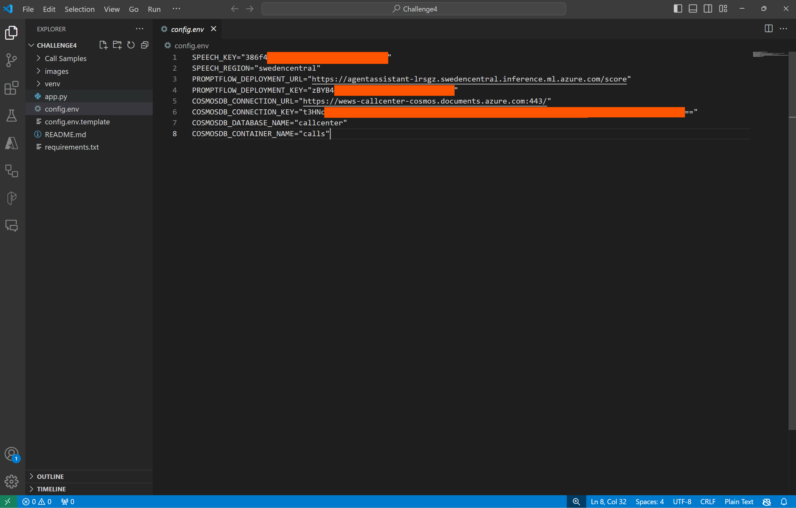
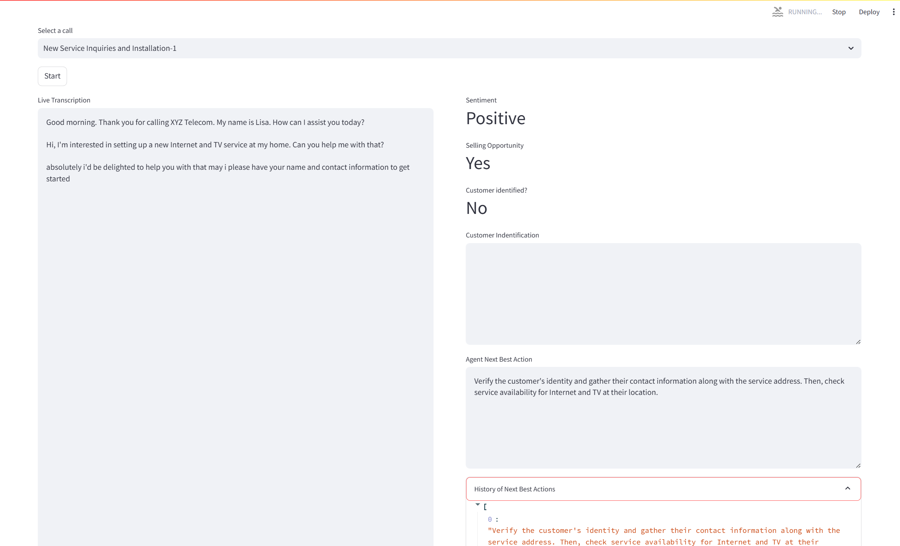

# Challenge 4 - Real-time call transcription and agent assistance

**Expected Duration:** 60 minutes

## Introduction

In the previous Challenge you created a Prompt Flow endpoint which can be used in an application to execute the flow defined in the previous challenges. In this challenge, you will create a real-time call transcription application that will assist the agent during the call. The application will transcribe the call in real time and provide suggestions to the agent based on the conversation and also save the call information in a Cosmos DB database.

To this extent, we will use a pre-recorded call sample and transcribe it in real time. The application will use the Azure Speech Service to transcribe the call in real-time and our application will call the Prompt Flow endpoint each time a new sentence has been spoken to provide suggestions to the agent. After the conversation finishes, the transcription is saved in a Cosmos DB database.

In a real-world scenario, you would use Azure AI Speech to transcribe the incoming call in real-time and not use pre-recorded calls. However, for the purpose of this challenge, we will use pre-recorded calls to simulate the real-time transcription.

The sample calls have been recorded and are available in the [Call Samples/Audio](<../Challenge4/Call Samples/Audio/>) folder. To generate the calls, the SOPs defined in the previous challenges were provided to an LLM which generated 3 transcripts per type of SOP and, using Azure AI Speech, the transcripts were converted to audio files.

You will be able to test the application with all of the Audio Samples or, if available to you, provide your own by including them in the [Call Samples](<../Challenge4/Call Samples/Audio/>) folder.

## Install the required programs
### Visual Studio Code
- Windows
    - Install [Visual Studio Code](https://code.visualstudio.com/)
- Linux
    - Install [Visual Studio Code](https://code.visualstudio.com/)
- Mac
    - Install [Visual Studio Code](https://code.visualstudio.com/)

### Python
- Windows
    - Install [Python 3.12.2](https://www.python.org/downloads/release/python-3125/)
- Linux
    - It is usually pre-installed. Check version with `python3 --version`.
- Mac
    - `brew install python3`

## Guide: Install Azure Web App Service extension
1. Open Visual Studio Code.
2. Click on the Extensions icon on the left sidebar.
3. Search for `Azure Web App Service` and click on `Install`.

## Guide: Setup local environment
1. Clone the repository to your local machine.
2. Navigate to the chosen location and locate the `Challenge4` folder.
3. Open this folder in Visual Studio Code.

4. Open a new terminal in Visual Studio Code. (You can use the top bar of Visual Studio, in the `Terminal` tab).
5. Create the virtual environment by running the following command:
    - Windows
        - `python -m virtualenv venv`
    - Linux / Mac
        - `virtualenv -p python3 venv`
6. Activate the virtual environment by running the following command:
    - Windows
        - `.\venv\Scripts\activate.ps1`
    - Linux / Mac
        - `source ./venv/bin/activate`
7. Install the necessary packages to run the application:
    - Windows / Mac / Linux
        - `pip install -r requirements.txt`
8. You can close the terminal.
9. Navigate to the `Challenge4` folder.
10. Duplicate the `config.env.template` file and rename it to `config.env`.
11. Open the `config.env` file and fill in the necessary information.
    * Navigate to the [Azure portal](https://portal.azure.com/#home) and login with your account.
    * Navigate to your resource group.
    * Select the `Azure AI services` resource. In the `Overview` section, you will find the `KEY 1` and `Location/Region` information. Fill in the `SPEECH_KEY` and `SPEECH_REGION` fields in the `config.env` file.
    
    * Navigate to your resource group.
    * Select the `Azure AI Studio` resource and launch it. Navigate to `Deployments` and select the deployment created in the previous [Challenge 3](../Challenge3/README.md). In the `Consume` section, you will find the `REST Endpoint` and `Primary Key`. Fill in the `PROMPTFLOW_DEPLOYMENT_URL` and `PROMPTFLOW_DEPLOYMENT_KEY` field in the `config.env` file.
    
    * Navigate to your resource group.
    * Select the `Cosmos DB Account` resource. In the left pane, select `Keys`. You will find the `URI` and `PRIMARY KEY` information (in the Read-write Keys). Fill in the `COSMOSDB_CONNECTION_URL` and `COSMOSDB_CONNECTION_KEY` fields in the `config.env` file.
    
    * Fill in the `COSMOSDB_DATABASE_NAME` and `COSMOSDB_CONTAINER_NAME` fields in the `config.env` file with the values specified in [Challenge 1](../Challenge1/README.md). If you followed the guide, the values should be `callcenter` and `calls`, respectively.
    

## Guide: Run the app
1. Navigate to the `Challenge4` folder.
2. Open a terminal window and run the following command: `streamlit run app.py`

3. A new tab will open in your default browser with the application running. If not, use the *Local URL* provided in the terminal.
4. From the dropdown list, you can select a [Call Sample](<../Challenge4/Call Samples/Audio/>) and click on the `Start` button.

5. The application will start transcribing the call and providing suggestions to the agent in real time. Every time the application detects that a complete phrase was spoken, it will call the Prompt Flow endpoint and update all the info to the agent.

6. Notice that in the terminal where streamlit was executed you will see the results of the transcription provided by Azure AI Speech in real-time, including each new word that it is able to capture.
6. After the transcription is finished, the application will save the call information in the Cosmos DB database.
7. Navigate to the [Azure portal](https://portal.azure.com/#home) and login with your account.
8. Navigate to your resource group.
9. Select the `Azure Cosmos DB` resource.
10. Navigate to the resource page and, from the left tabs, select `Data Explorer`.
11. You should see your database and container created in [Challenge 1](../Challenge1/README.md).
12. With the transcriptions available in the `calls` container, you can later use the data to analyze the calls and evaluate the performance of your call center operations. You can find an example of this [here](https://github.com/microsoft/Customer-Service-Conversational-Insights-with-Azure-OpenAI-Services).

## Conclusion
In this challenge, you created a real-time call transcription application that assists the agent during the call. The application transcribes the call in real-time and provides suggestions to the agent based on the conversation. The application also saves the call information in a Cosmos DB database.

## Learning Material
- [Customer Service Conversational Insights with Azure OpenAI Services](https://github.com/microsoft/Customer-Service-Conversational-Insights-with-Azure-OpenAI-Services)
- [Streamlit](https://streamlit.io/)